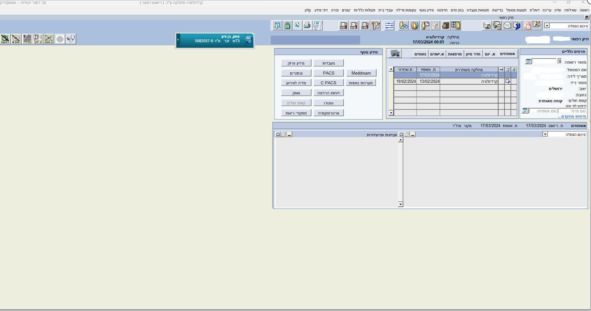

# Hadassah Smart Medical Transcription System

This project is a web-based application designed for medical transcription, providing doctors and medical staff with a seamless way to record, upload, transcribe, and summarize medical conversations. The system supports Hebrew and integrates with Amazon Web Services (AWS) for storage, transcription, and further text processing.

## Features

- **Audio Recording**: Start and stop real-time audio recording directly within the application.
- **File Upload**: Upload pre-recorded audio files (WAV or MP3) for transcription.
- **Transcription**: Generate raw, cleaned, and summarized text using AWS Transcribe and Amazon Bedrock's Claude model.
- **Text Cleaning**: Automatically correct transcription errors and format the text for readability.
- **Summarization**: Generate concise summaries with key sections like:
  - Chief Complaint
  - Medical History
  - Treatment Plan and Recommendations
- **Interactive Editing**: View and edit the summarized text before saving.
- **Responsive Web Interface**: Designed for easy navigation and usability.

## Architecture

The application is built using the following technologies:

- **Frontend**: Streamlit and custom HTML/CSS.
- **Backend**: Python with integration to AWS services (S3, Transcribe, Bedrock).
- **Cloud Services**:
  - **Amazon S3**: For storing audio files and transcriptions.
  - **Amazon Transcribe**: For real-time and batch transcription.
  - **Amazon Bedrock**: For text cleaning and summarization.

## Installation

1. Clone this repository:
   ```bash
   git clone https://github.com/your-username/your-repo-name.git
   cd your-repo-name
   ```

2. Install required dependencies:
   ```bash
   pip install -r requirements.txt
   ```

3. Configure AWS credentials:
   - Add your AWS credentials to a `.env` file:
     ```
     AWS_ACCESS_KEY_ID=your-access-key-id
     AWS_SECRET_ACCESS_KEY=your-secret-access-key
     AWS_REGION=us-east-1
     ```

4. Run the application:
   ```bash
   streamlit run main.py
   ```

5. Access the application in your web browser at `http://localhost:8501`.

## Usage

1. **Home Screen**: Choose between uploading an audio file or starting a real-time recording.
2. **Transcription**: Wait for the audio to be processed and transcribed.
3. **View Results**: Review the raw transcription, cleaned text, and summarized content.
4. **Edit and Save**: Make changes to the summarized text and save it.

## File Overview

- `main.py`: The main entry point for the Streamlit app.
- `ai_agent.py`: Handles text cleaning and summarization using Amazon Bedrock.
- `recording.py`: Implements real-time recording and transcription processing.
- `uploader.py`: Handles file uploads and initiates transcription.
- `display_buttons.py`: Displays options to view different stages of the transcription.
- `handlers.py`: Manages custom event handling for transcription streams.
- `index.html`: Provides a custom landing page for the application.

## Screenshots



## Future Enhancements

- Add multi-language support.
- Expand speaker identification to handle more participants.
- Enhance summarization logic for detailed medical contexts.

## License

This project is licensed under the [MIT License](LICENSE).

## Acknowledgments

- [Streamlit](https://streamlit.io/) for the user interface.
- [AWS Services](https://aws.amazon.com/) for transcription and text processing.
